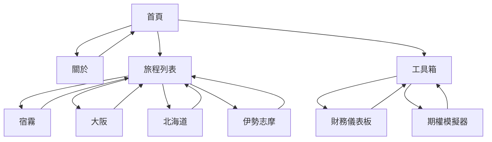

# 網站地圖 (Sitemap)

> 最後更新：2024-12-22

## 視覺化結構

```
🏠 首頁 (index.html)
│
├── 👤 ABOUT (about.html)
│   └── ← 返回首頁
│
├── ✈️ SELECT TRIP (trips.html)
│   ├── 🌴 2025 宿霧 (trips/2025-cebu/)
│   ├── 🏯 2025 大阪 (trips/2025-osaka/)
│   ├── ❄️ 2026 北海道 (trips/2026-hokkaido/)
│   └── 🦐 2026 伊勢志摩 (trips/2026-ise-shima/)
│       ├── 行程總覽
│       ├── 每日詳情
│       ├── 行程地圖
│       ├── 美食指南
│       └── 預算規劃
│
└── 🔧 TOOLS & CONTACT (tools.html)
    ├── 📊 財務儀表板 (tools/financial-dashboard.html)
    ├── 📈 期權策略模擬器 (tools/bull-put-spread.html)
    └── 📧 聯絡方式
```

## 頁面清單

| 頁面          | 路徑                               | 狀態     |
| ------------- | ---------------------------------- | -------- |
| 首頁          | `/index.html`                      | ✅ 完成   |
| 關於          | `/about.html`                      | ✅ 完成   |
| 旅程列表      | `/trips.html`                      | ✅ 完成   |
| 工具箱        | `/tools.html`                      | ✅ 完成   |
| 2025 宿霧     | `/trips/2025-cebu/index.html`      | ✅ 完成   |
| 2025 大阪     | `/trips/2025-osaka/index.html`     | 🚧 建置中 |
| 2026 北海道   | `/trips/2026-hokkaido/index.html`  | 🚧 建置中 |
| 2026 伊勢志摩 | `/trips/2026-ise-shima/index.html` | ✅ 完成   |
| 財務儀表板    | `/tools/financial-dashboard.html`  | ✅ 完成   |
| 期權模擬器    | `/tools/bull-put-spread.html`      | ✅ 完成   |

## 導航流程


