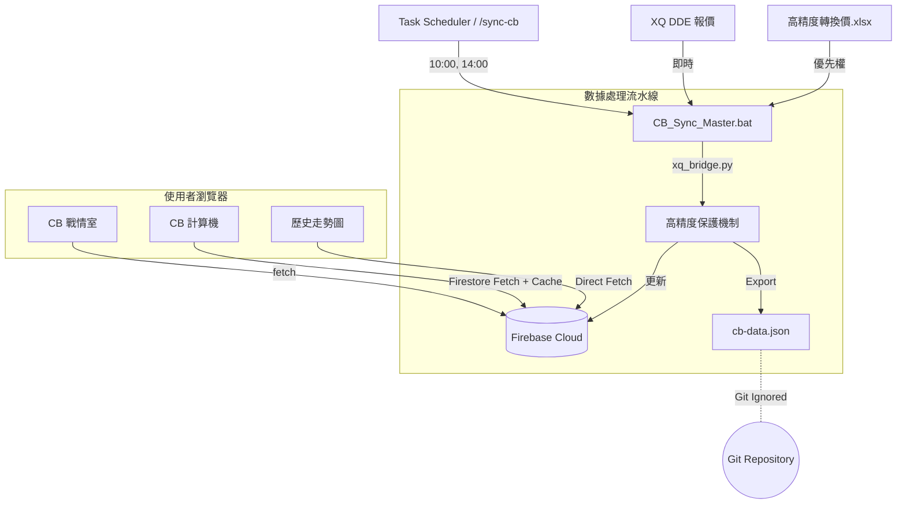

# CB 爬蟲資料流架構 (CB Crawler Data Flow Architecture)

> **最後更新日期**: 2026-01-30
> **狀態**: Production Ready (Meta-Automation V1.7)

本文件詳細記錄了「可轉債 (CB) 戰情室」與「計算機」背後的自動化資料流架構。此系統採用 **雙軌並行 (Dual Track)** 策略，確保熱門數據的即時性，同時維持全市場搜索的完整性。

## 核心策略：雙軌分流 (Dual Track Strategy)

為了解決單一檔案無法同時滿足「精簡熱門排行」與「完整市場搜尋」的矛盾，我們將資料流拆分為兩條獨立路徑：

### 1. 路徑 A：戰情室熱門清單 (Hot List) 🏎️

- **目標檔案**: `public/data/hot-cb.json`
- **內容**: 嚴格篩選的 **Top 20** 成交量熱門可轉債。
- **資料特性**:
  - **輕量**: 檔案極小，前端載入無負擔。
  - **即時**: 僅包含當日有交易且成功抓取到價格的標的，保證無 `NaN`。
- **用途**: 專供 `cb-war-room.html` (戰情室) 顯示。

### 2. 路徑 B：全市場搜尋目錄 (Master Directory) 📖

- **主要來源**: **Firestore (`cb_history` collection)**
- **內容**: 市場上 **300+ 檔** 所有可轉債的總集。
- **資料特性**:
  - **解耦**: `cb-data.json` 不再進入 Git 倉庫，解決了 **"Data in Code" 反模式**，避免 Git 歷史冗餘。
  - **即時**: 每次同步後，Firestore 即為權威版本，前端無需等待部署即可讀取。
  - **風險管理**：
    - **離線支援**：實作前端 `LocalStorage` 緩存，確保在斷網時仍能使用搜尋功能。
    - **費用控制**：僅在緩存過期（1 小時）或手動強制重新載入時才 Fetch Firestore，極小化雲端讀取成本。
- **用途**: 供 `cb-calculator.html` (計算機) 使用。

## 自動化循環 (The Automation Loop)

系統依賴本地 Task Scheduler 或手動執行進行維護。

### 📅 排程 (Schedule)

- **每週一 10:00 (UTC+8)**: 週初同步。
- **每週五 14:00 (UTC+8)**: 週末同步 (主要資料更新點)。

### 🔄 執行流程

1.  **觸發 (Trigger)**: Task Scheduler 啟動 `CB_Sync_Master.bat` 或 AI 執行 `/sync-cb`。
2.  **同步 (Sync)**: 執行 `xq_bridge.py` 串接 DDE 數據與 Excel 高精度數據。
3.  **寫入 (Write)**: 直接更新 Firestore `cb_history` 集合。
4.  **本地快取**: 產出本地 `cb-data.json`（已在 `.gitignore` 中忽略，不進 Git）。
5.  **前端載入**: 使用者開啟頁面時，前端 JS 直接由 Firestore Fetch 最新數據。

## 架構視覺化 (Architecture Diagram)



## 檔案結構說明

```text
/public/data/
├── hot-cb.json       # [Ignored] 熱門清單
├── cb-data.json      # [Ignored] 市場全集 (僅供本地快取)
└── history/          # [Deprecated] 舊版歷史資料夾
```
