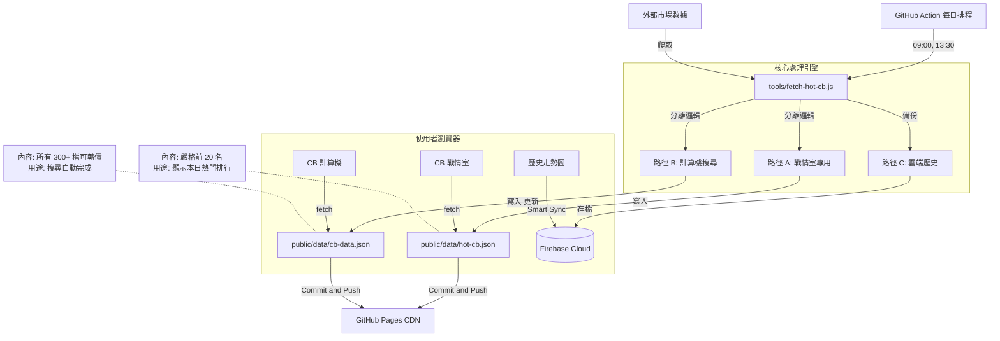

# CB 爬蟲資料流架構 (CB Crawler Data Flow Architecture)

> **最後更新日期**: 2026-01-27
> **狀態**: Production Ready (已上線)

本文件詳細記錄了「可轉債 (CB) 戰情室」與「計算機」背後的自動化資料流架構。此系統採用 **雙軌並行 (Dual Track)** 策略，確保熱門數據的即時性，同時維持全市場搜索的完整性。

## 核心策略：雙軌分流 (Dual Track Strategy)

為了解決單一檔案無法同時滿足「精簡熱門排行」與「完整市場搜尋」的矛盾，我們將資料流拆分為兩條獨立路徑：

### 1. 路徑 A：戰情室熱門清單 (Hot List) 🏎️

- **目標檔案**: `public/data/hot-cb.json`
- **內容**: 嚴格篩選的 **Top 20** 成交量熱門可轉債。
- **資料特性**:
  - **輕量**: 檔案極小，前端載入無負擔。
  - **即時**: 僅包含當日有交易且成功抓取到價格的標的，保證無 `NaN`。
- **用途**: 專供 `cb-war-room.html` (戰情室) 顯示。

### 2. 路徑 B：全市場搜尋目錄 (Master Directory) 📖

- **目標檔案**: `public/data/cb-data.json`
- **內容**: 市場上 **300+ 檔** 所有可轉債的總集。
- **資料特性**:
  - **完整**: 包含所有已知的可轉債代號與名稱。
  - **混合更新**: 若當日有抓到新價格則更新，若無則保留舊資料。
- **用途**: 供 `cb-calculator.html` (計算機) 的搜尋框 (Autocomplete) 使用，確保使用者能查到任何一檔標的。

## 自動化循環 (The Automation Loop)

系統依賴 GitHub Actions 進行每日的全自動維護，完全無需人工介入。

### 📅 排程 (Schedule)

- **每日 09:00 (UTC+8)**: 開盤前檢查。
- **每日 13:30 (UTC+8)**: 收盤後更新 (主要資料產出點)。

### 🔄 執行流程

1.  **觸發 (Trigger)**: GitHub Action 啟動 `daily-hot-cb.yml` 工作流程。
2.  **執行 (Execute)**: 運行 `tools/fetch-hot-cb.js` 腳本。
3.  **分流 (Split)**: 腳本內部分別產出 `hot-cb.json` 與 `cb-data.json`。
4.  **提交 (Commit)**: Action 自動偵測檔案變更，並 Commit 回 Repository。
5.  **部署 (Deploy)**: GitHub Pages 自動重新部署，前端使用者即可讀取到最新 JSON。

## 架構視覺化 (Architecture Diagram)



## 檔案結構說明

```text
/public/data/
├── hot-cb.json       # [New] 每日 Top 20 熱門股 (無雜質)
├── cb-data.json      # [Master] 全市場通訊錄
└── history/          # [Deprecated] 舊版歷史資料夾 (已清空)
```
