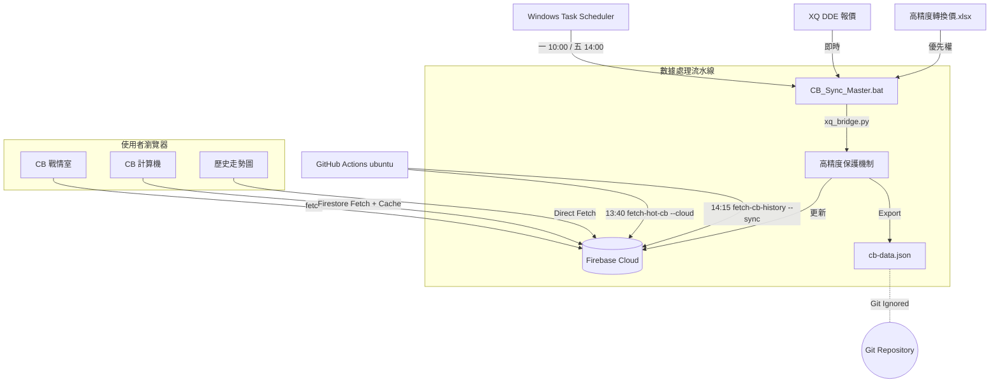

# CB 爬蟲資料流架構 (CB Crawler Data Flow Architecture)

> **最後更新日期**: 2026-07-06
> **狀態**: Production Ready (Meta-Automation V1.8 — 補記 GitHub Actions 雙軌與平台前提)

本文件詳細記錄了「可轉債 (CB) 戰情室」與「計算機」背後的自動化資料流架構。此系統採用 **雙軌並行 (Dual Track)** 策略，確保熱門數據的即時性，同時維持全市場搜索的完整性。

## 核心策略：雙軌分流 (Dual Track Strategy)

為了解決單一檔案無法同時滿足「精簡熱門排行」與「完整市場搜尋」的矛盾，我們將資料流拆分為兩條獨立路徑：

### 1. 路徑 A：戰情室熱門清單 (Hot List) 🏎️

- **目標檔案**: `public/data/hot-cb.json`
- **內容**: 嚴格篩選的 **Top 20** 成交量熱門可轉債。
- **資料特性**:
  - **輕量**: 檔案極小，前端載入無負擔。
  - **即時**: 僅包含當日有交易且成功抓取到價格的標的，保證無 `NaN`。
- **用途**: 專供 `cb-war-room.html` (戰情室) 顯示。

### 2. 路徑 B：全市場搜尋目錄 (Master Directory) 📖

- **主要來源**: **Firestore (`cb_history` collection)**
- **內容**: 市場上 **300+ 檔** 所有可轉債的總集。
- **資料特性**:
  - **解耦**: `cb-data.json` 不再進入 Git 倉庫，作為 **CLI 工具鍊的本地快取 (Local Cache)**，供後端維護腳本使用。
  - **權威性**: 前端計算機 (`cb-calculator.html`) 直接查詢 Firestore，**不再依賴此檔案**。
  - **即時**: 每次同步後，Firestore 即為權威版本，前端無需等待部署即可讀取。
  - **風險管理**：
    - **離線支援**：實作前端 `LocalStorage` 緩存，確保在斷網時仍能使用搜尋功能。
    - **費用控制**：僅在緩存過期（1 小時）或手動強制重新載入時才 Fetch Firestore，極小化雲端讀取成本。
- **用途**: 供 `backfill-to-firebase.js` 等 CLI 維護工具查詢中繼資料。

## 自動化循環 (The Automation Loop)

自動化分為**兩條獨立軌道**，平台前提不同：

### ☁️ 軌道一：GitHub Actions（雲端，每交易日自動）

平台無關，跑在 GitHub 的 ubuntu runner 上，憑證來自 repo secrets（`FIREBASE_SERVICE_ACCOUNT`）。

| Workflow | 排程 (UTC+8) | 執行內容 |
| --- | --- | --- |
| `daily-hot-cb.yml` | 週一至五 13:40（收盤後） | `node tools/fetch-hot-cb.js --cloud` 抓熱門清單上雲 |
| `daily-cb-history.yml` | 週一至五 14:15（行情更新後） | `node tools/fetch-cb-history.js --all --smart --sync` 補歷史資料 |

兩者皆支援 `workflow_dispatch` 手動補跑。健康檢查：`gh run list --workflow=daily-hot-cb.yml --limit 5`。

### 🖥️ 軌道二：本地 XQ DDE（**僅限 Windows 交易機**）

> ⚠️ **平台前提**：此軌道依賴 XQ 全球贏家的 DDE 介面與 Windows Task Scheduler，
> **只能在 Windows 交易機上執行**（`setup_scheduler.ps1` 內的路徑為該機器的 `c:\Users\forev\myDev\me`）。
> 在 macOS 開發機上無法執行，也不需要執行——高精度轉換價與 Excel 資料的同步屬交易機職責。

- **排程**：每週一 10:00、每週五 14:00 (UTC+8)，由 Windows Task Scheduler 觸發。
- **執行流程**：
  1.  **觸發 (Trigger)**: Task Scheduler 啟動 `CB_Sync_Master.bat`（或手動執行 `npm run sync-cb` 做 dry-run 預覽）。
  2.  **同步 (Sync)**: 執行 `xq_bridge.py` 串接 DDE 數據與 Excel 高精度數據。
  3.  **寫入 (Write)**: 直接更新 Firestore `cb_history` 集合。
  4.  **本地快取**: 產出本地 `cb-data.json`（已在 `.gitignore` 中忽略，不進 Git）。
  5.  **前端載入**: 使用者開啟頁面時，前端 JS 直接由 Firestore Fetch 最新數據。

### 兩軌分工

- **Actions 軌**負責「每日行情與歷史資料」的例行更新，無人值守。
- **本地 DDE 軌**負責「高精度轉換價／Excel 優先權資料」的權威覆寫，頻率低但精度高。

## 架構視覺化 (Architecture Diagram)


```mermaid
graph TD
    %% 雲端軌 (GitHub Actions, 每交易日)
    GHA[GitHub Actions ubuntu] -->|13:40 fetch-hot-cb --cloud| Firestore
    GHA -->|14:15 fetch-cb-history --sync| Firestore

    %% 本地軌 (Windows 交易機)
    Sched[Windows Task Scheduler] -->|一 10:00 / 五 14:00| Bat[CB_Sync_Master.bat]
    DDE[XQ DDE 報價] -->|即時| Bat
    Excel[高精度轉換價.xlsx] -->|優先權| Bat

    %% 核心處理
    subgraph Data_Pipe [數據處理流水線]
        Bat -->|xq_bridge.py| Protect[高精度保護機制]
        Protect -->|更新| Firestore[(Firebase Cloud)]
        Protect -->|Export| LocalJSON[cb-data.json]
    end

    %% Git 隔離
    LocalJSON -.-|Git Ignored| GitRepo((Git Repository))

    %% 使用者端 (瀏覽器)
    subgraph Client_Side [使用者瀏覽器]
        WarRoom[CB 戰情室] -->|fetch| Firestore
        Calculator[CB 計算機] -->|Firestore Fetch + Cache| Firestore
        HistoryService[歷史走勢圖] -->|Direct Fetch| Firestore
    end
```

## 檔案結構說明

```text
/public/data/
├── hot-cb.json       # [Ignored] 熱門清單
├── cb-data.json      # [Ignored] 市場全集 (僅供本地快取)
└── history/          # [Deprecated] 舊版歷史資料夾
```
