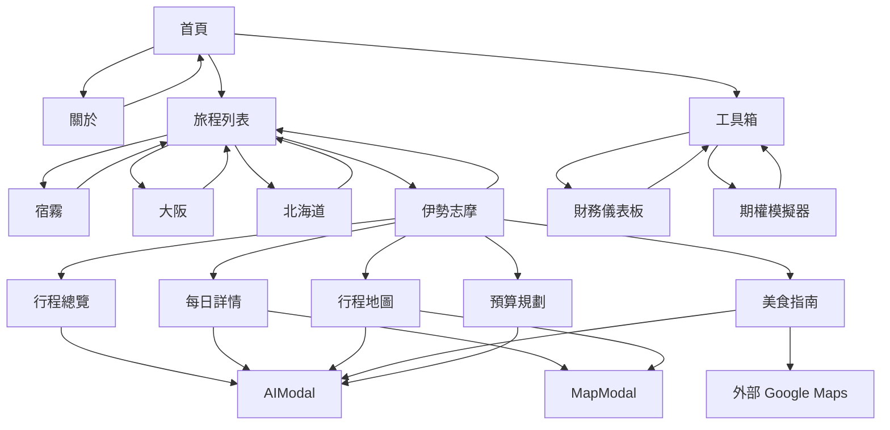

# 網站地圖 (Sitemap)

> 最後更新：2024-12-22

## 視覺化結構

```
🏠 首頁 (index.html)
│
├── 👤 ABOUT (about.html)
│   └── ← 返回首頁
│
├── ✈️ SELECT TRIP (trips.html)
│   ├── 🌴 2025 宿霧 (trips/2025-cebu/)
│   ├── 🏯 2025 大阪 (trips/2025-osaka/)
│   ├── ❄️ 2026 北海道 (trips/2026-hokkaido/)
│   └── 🦐 2026 伊勢志摩 (trips/2026-ise-shima/)
│       ├── 📋 行程總覽 (overview)
│       │   ├── 行程亮點
│       │   ├── 階段總覽
│       │   └── 實用連結
│       ├── 📅 每日詳情 (itinerary)
│       │   ├── 第一階段：Day 1-6
│       │   └── 第二階段：Day 7-10
│       ├── 🗺️ 行程地圖 (map)
│       │   ├── 近鐵特急比較表
│       │   ├── 巴士時刻表
│       │   └── 每日路徑總覽
│       ├── 🍽️ 美食指南 (food)
│       │   ├── 臨空城
│       │   ├── VISON 園區
│       │   ├── 伊勢 托福橫丁
│       │   ├── 賢島
│       │   ├── 大阪 梅田
│       │   └── USJ 環球影城
│       └── 💰 預算規劃 (budget)
│
└── 🔧 TOOLS & CONTACT (tools.html)
    ├── 📊 財務儀表板 (tools/financial-dashboard.html)
    ├── 📈 期權策略模擬器 (tools/bull-put-spread.html)
    └── 📧 聯絡方式
```

## 頁面清單

| 頁面          | 路徑                               | 狀態     |
| ------------- | ---------------------------------- | -------- |
| 頁面          | 路徑                               | 狀態     |
| ------------- | ---------------------------------- | -------- |
| 首頁          | `/index.html`                      | ✅ 完成   |
| 關於          | `/about/`                          | ✅ 完成   |
| 旅程列表      | `/trips/`                          | ✅ 完成   |
| 工具箱        | `/tools/`                          | ✅ 完成   |
| 2025 宿霧     | `/trips/2025-cebu/index.html`      | ✅ 完成   |
| 2025 大阪     | `/trips/2025-osaka/index.html`     | 🚧 建置中 |
| 2026 北海道   | `/trips/2026-hokkaido/index.html`  | 🚧 建置中 |
| 2026 伊勢志摩 | `/trips/2026-ise-shima/index.html` | ✅ 完成   |
| 財務儀表板    | `/tools/financial-dashboard.html`  | ✅ 完成   |
| 期權模擬器    | `/tools/bull-put-spread.html`      | ✅ 完成   |

## 旅程詳情頁分頁結構

以 **2026 伊勢志摩** 為例，每個旅程詳情頁包含以下分頁：

| 分頁 ID     | 圖示         | 名稱     | 功能                       |
| ----------- | ------------ | -------- | -------------------------- |
| `overview`  | 🗺️ MapIcon    | 行程總覽 | 亮點、階段摘要、實用連結   |
| `itinerary` | 📅 Calendar   | 每日詳情 | 可折疊的每日行程卡片       |
| `map`       | 🧭 Navigation | 行程地圖 | 交通資訊、時刻表、路線總覽 |
| `food`      | 🍽️ Utensils   | 美食指南 | 分區餐廳列表、收藏功能     |
| `budget`    | 💰 Wallet     | 預算規劃 | 費用明細表                 |

## Modal 彈窗

| 彈窗         | 觸發方式               | 功能                |
| ------------ | ---------------------- | ------------------- |
| **MapModal** | 點擊活動項目的地圖圖示 | 嵌入 Google Maps    |
| **AIModal**  | 點擊右下角 FAB 按鈕    | AI 聊天、素食溝通卡 |

## 導航流程



## URL 參數

| 頁面 | 參數                  | 說明                       |
| ---- | --------------------- | -------------------------- |
| 首頁 | `?booted=true#booted` | 跳過開機動畫，直接進入選單 |
